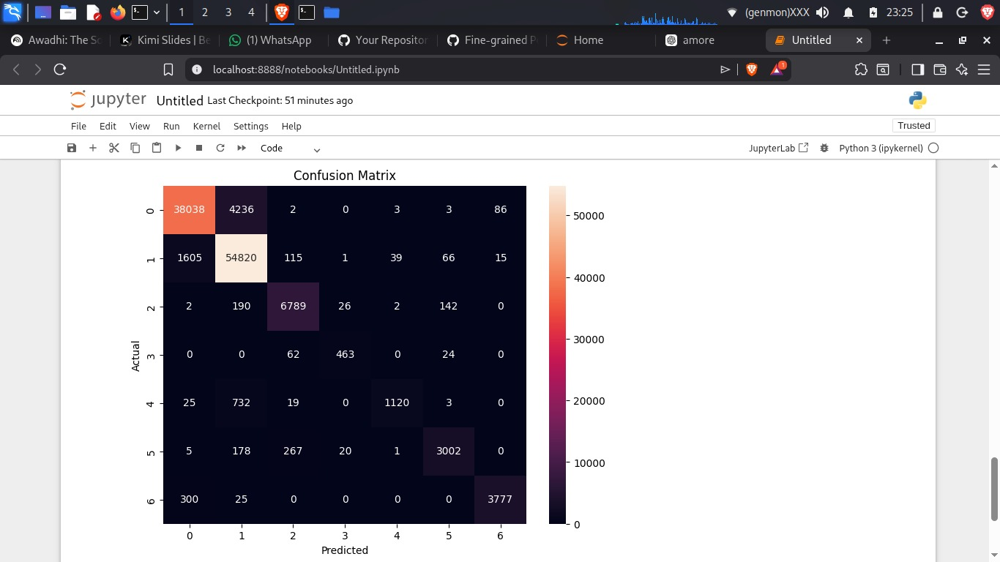

End-to-End ML Pipeline with Model Comparison and Class-Level Analysis

# Forest Cover Type Classification using Machine Learning

## Overview
This project focuses on predicting forest cover types based on cartographic and environmental features using supervised machine learning techniques. The dataset contains over 580,000 instances and 54 input features describing terrain and soil characteristics.

The objective is to build a robust multi-class classification model and compare ensemble methods for performance and generalization.

---

## Dataset
- Source: UCI Machine Learning Repository (Covertype Dataset)
- Instances: 581,012
- Features: 54 numerical features
- Target: 7 Forest Cover Types
- Problem Type: Multi-Class Classification

---

## Methodology

### 1. Data Preparation
- Loaded raw `.data` file (no headers)
- Separated features and target
- Converted class labels from 1–7 to 0–6 (for XGBoost compatibility)
- Stratified train-test split (80/20) to preserve class distribution

### 2. Models Implemented
- Random Forest Classifier
- XGBoost Classifier

### 3. Evaluation Metrics
- Accuracy
- Precision
- Recall
- F1-Score
- Confusion Matrix
- Macro and Weighted Averages

---

## Results

| Model          | Accuracy | Macro F1 | Minority Class Recall |
|---------------|----------|----------|-----------------------|
| Random Forest | 0.9294   | ~0.89    | 0.59 (Class 5)        |
| XGBoost       | 0.8896   | ~0.87    | 0.64 (Class 5)        |

---
## Confusion Matrix

## Key Observations
- Random Forest achieved higher overall accuracy.
- XGBoost slightly improved recall for minority class but reduced overall accuracy.
- Dataset is imbalanced; minority classes are harder to predict.
- Ensemble tree-based models perform exceptionally well on structured tabular data.

---

## Conclusion
Random Forest emerged as the stronger baseline model for this dataset, providing superior overall performance with minimal hyperparameter tuning. XGBoost shows potential for further improvement with advanced tuning techniques.

---

## Tech Stack
- Python
- Pandas
- NumPy
- Scikit-learn
- XGBoost
- Matplotlib / Seaborn

---

## How to Run

1. Install dependencies:

pip install -r requirements.txt

2. Run the notebook inside:

notebooks/forest_cover_classification.ipynb

---

## Future Improvements
- Hyperparameter tuning with GridSearchCV
- Class imbalance handling using SMOTE
- Feature engineering based on domain insights
- Model deployment as API (Flask/FastAPI)

---
## Technical Insights

- Ensemble tree-based models perform exceptionally well on structured, high-dimensional tabular datasets without extensive feature scaling.
- RandomForest achieved higher overall accuracy due to its robustness and stability on large datasets.
- XGBoost demonstrated improved sensitivity toward minority classes but requires careful hyperparameter tuning to outperform strong bagging baselines.
- Class imbalance significantly impacts recall for underrepresented classes, highlighting the importance of evaluating macro-averaged metrics alongside overall accuracy.
- Stratified train-test splitting ensures fair evaluation by preserving class distribution across training and testing sets.

---
## Reproducibility

All experiments were conducted with fixed random_state values to ensure reproducibility of results.
